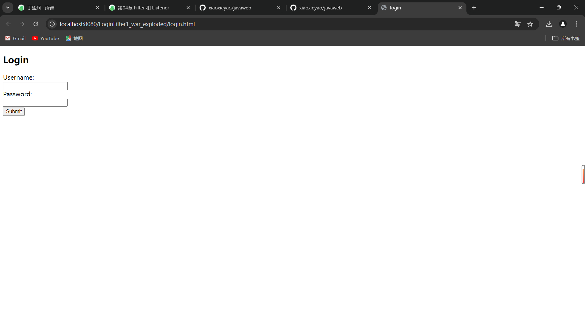
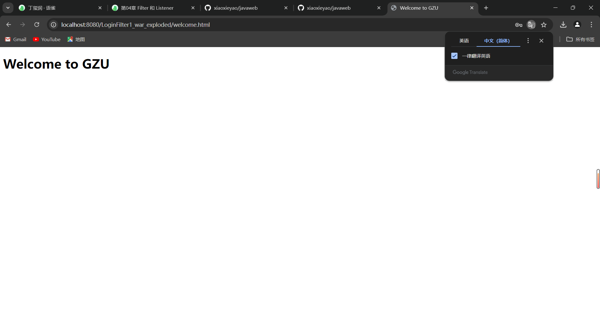

# 第二次作业Filter
## LoginFilter代码
```
package com.gzu.loginfilter1;

import jakarta.servlet.*;
import jakarta.servlet.annotation.WebFilter;
import jakarta.servlet.http.HttpServletRequest;
import jakarta.servlet.http.HttpServletResponse;

import java.io.IOException;
import java.util.Arrays;
import java.util.List;

@WebFilter("/*")  // 应用该过滤器于所有 URL 路径
public class LoginFilter implements Filter {
    // 定义静态资源扩展名列表
    private static final List<String> STATIC_EXTENSIONS = Arrays.asList(
           ".css", ".js", ".jpg", ".png", ".gif", ".ico", ".html", ".jsp", "/login"
    );

    @Override
    public void doFilter(ServletRequest servletRequest, ServletResponse servletResponse, FilterChain filterChain) throws IOException, ServletException {
        // 转换请求和响应为 HTTP 类型
        HttpServletRequest request = (HttpServletRequest) servletRequest;
        HttpServletResponse response = (HttpServletResponse) servletResponse;

        /*
         静态资源判断
         使用 anyMatch 来确定请求的 URI 是否包含其中的任何一个扩展名 之前错误写成all
        */
        boolean isStaticResource = STATIC_EXTENSIONS.stream().anyMatch(ext -> {
            System.out.println("ext:"+ext);
            return request.getRequestURI().contains(ext);
        });

        if (isStaticResource) {
            filterChain.doFilter(servletRequest, servletResponse);
        }else {
            /* 用户登录检查 */
            String username = (String)request.getSession().getAttribute("user");
             if( username == null) {
                 // 在实际情况下，不建议将空字符串作为有效的登录用户名，因此可以去掉 "" 的检查，仅保留 null。
                response.sendRedirect(request.getContextPath() + "/login.html");
            }else {
                filterChain.doFilter(servletRequest, servletResponse);
            }
        }
    }

    @Override
    public void init(FilterConfig filterConfig) throws ServletException {
        Filter.super.init(filterConfig);
    }

    @Override
    public void destroy() {
        Filter.super.destroy();

    }
}

```
## LoginServlet代码
```
package com.gzu.loginfilter1;

import jakarta.servlet.ServletException;
import jakarta.servlet.annotation.WebServlet;
import jakarta.servlet.http.HttpServlet;
import jakarta.servlet.http.HttpServletRequest;
import jakarta.servlet.http.HttpServletResponse;

import java.io.IOException;

/*
用于将 LoginServlet 映射到 /login 路径。
即，当客户端向 /login 路径发出请求时，会由这个 LoginServlet 来处理请求。
*/
@WebServlet("/login")
public class LoginServlet extends HttpServlet {

    @Override
    protected void doPost(HttpServletRequest req, HttpServletResponse resp) throws ServletException, IOException {
        /*
        req.getParameter("username") 和 req.getParameter("password") 用于从 HttpServletRequest 对象中获取表单中 username 和 password 的值。
        这些参数通常来自登录页面的 HTML 表单
        */
        String username = req.getParameter("username");
        String password = req.getParameter("password");
//        System.out.println("username: " + username +", password" + password);
        if("abc".equals(username) && "123456".equals(password)){
            /*
             这段代码将输入的 username 和 password 与预设的字符串 "abc" 和 "123456" 进行比较。
            如果用户名为 "abc" 且密码为 "123456"，则登录成功，并执行以下操作：
            将 username 存储在当前会话 (HttpSession) 中，键名为 "user"。
            使用 resp.sendRedirect("welcome.html") 重定向客户端到欢迎页面 welcome.html。
            如果用户名或密码不匹配，则登录失败，使用 resp.sendRedirect("login.html") 将用户重定向回登录页面 login.html。
            */
            req.getSession().setAttribute("user", username);
            resp.sendRedirect("welcome.html");
    }else {
            resp.sendRedirect("login.html");
        }
    }

}
```
### 运行界面

输入用户密码后
